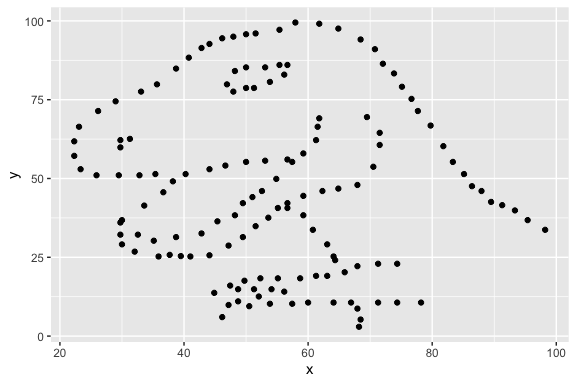
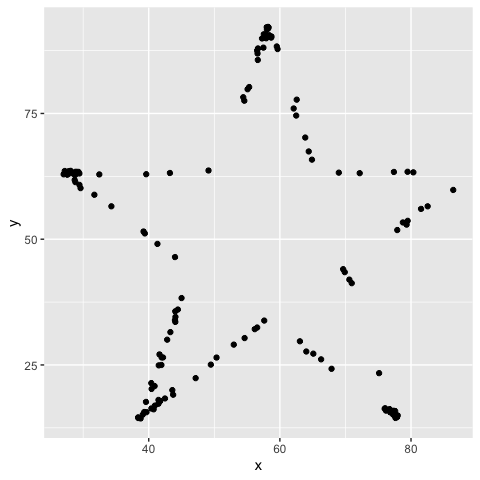
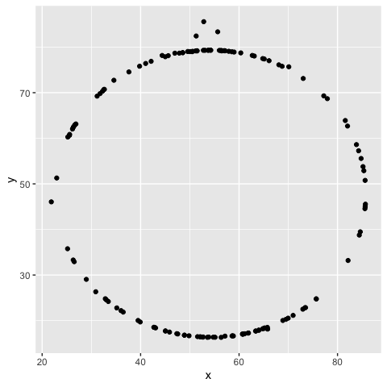

Lab 01 - Hello R
================
Conor Lacey
01/12/2023

## Load packages and data

``` r
library(tidyverse) 
```

    ## Warning: package 'tidyverse' was built under R version 4.1.2

    ## Warning: package 'ggplot2' was built under R version 4.1.2

    ## Warning: package 'tibble' was built under R version 4.1.2

    ## Warning: package 'readr' was built under R version 4.1.2

    ## Warning: package 'dplyr' was built under R version 4.1.2

``` r
library(datasauRus)
```

    ## Warning: package 'datasauRus' was built under R version 4.1.2

## Exercises

### Exercise 1

There are 1846 rows and 3 columns. The variables in the data include the
dataset variable, x variable, and y variable.

### Exercise 2

Plot of the data in the dino dataset:

``` r
dino_data <- datasaurus_dozen %>%
  filter(dataset == "dino")

ggplot(data = dino_data, mapping = aes(x = x, y = y)) +
  geom_point()
```

<!-- -->

The correlation between `x` and `y` in this dataset:

``` r
dino_data %>%
  summarize(r = cor(x, y))
```

    ## # A tibble: 1 × 1
    ##         r
    ##     <dbl>
    ## 1 -0.0645

### Exercise 3

Plot of the data in the star dataset:

``` r
dino_data <- datasaurus_dozen %>%
  filter(dataset == "star")

ggplot(data = dino_data, mapping = aes(x = x, y = y)) +
  geom_point()
```

<!-- -->

The correlation between `x` and `y` in the star dataset:

``` r
dino_data %>%
  summarize(r = cor(x, y))
```

    ## # A tibble: 1 × 1
    ##         r
    ##     <dbl>
    ## 1 -0.0630

The correlation of the star dataset is very similar to that of the dino
dataset.

### Exercise 4

Plot of the data in the circle dataset:

``` r
dino_data <- datasaurus_dozen %>%
  filter(dataset == "circle")

ggplot(data = dino_data, mapping = aes(x = x, y = y)) +
  geom_point()
```

<!-- -->

The correlation between `x` and `y` in the circle dataset:

``` r
dino_data %>%
  summarize(r = cor(x, y))
```

    ## # A tibble: 1 × 1
    ##         r
    ##     <dbl>
    ## 1 -0.0683

The correlation here is a bit bigger negative wise, but again it is
about the same. In general the correlations of each dataset is quite
small teetering between -0.062 and -0.069.

### Exercise 5

A plot of all the datasets

``` r
ggplot(datasaurus_dozen, aes(x = x, y = y, color = dataset))+
  geom_point()+
  facet_wrap(~ dataset, ncol = 3) +
  theme(legend.position = "none")
```

<!-- -->

A summary of all the correlation coefficients

``` r
datasaurus_dozen %>%
  group_by(dataset) %>%
  summarize(r = cor(x, y)) %>%
  print(26)
```

    ## # A tibble: 13 × 2
    ##    dataset          r
    ##    <chr>        <dbl>
    ##  1 away       -0.0641
    ##  2 bullseye   -0.0686
    ##  3 circle     -0.0683
    ##  4 dino       -0.0645
    ##  5 dots       -0.0603
    ##  6 h_lines    -0.0617
    ##  7 high_lines -0.0685
    ##  8 slant_down -0.0690
    ##  9 slant_up   -0.0686
    ## 10 star       -0.0630
    ## 11 v_lines    -0.0694
    ## 12 wide_lines -0.0666
    ## 13 x_shape    -0.0656

## Bonus Tips by Yoo Ri

Here are some helpful tips :)

- filter() is for extracting rows

- group_by() is for grouping datasets by assigned column

- ungroup() cancels the grouping

- summarize() is often used with group_by(). This function can print the
  output according to the group_by().

- facet_grid(y\~x,…) creates a grid with variable y as a row, variable x
  as a column  

- facet_wrap(x,… ) is useful when there is only one variable
